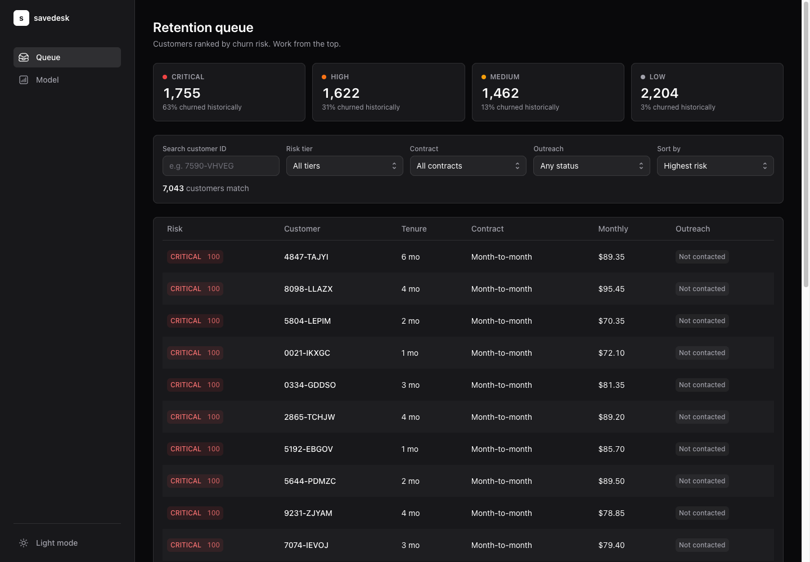
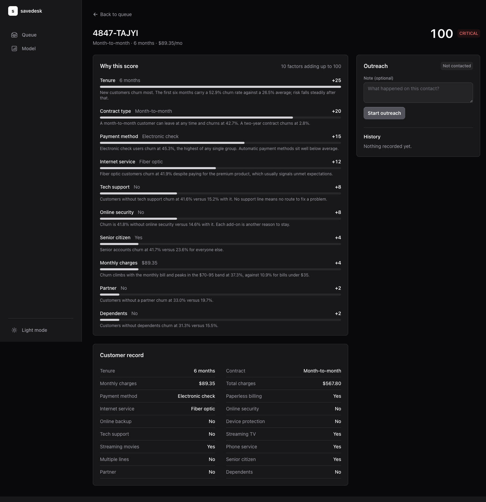
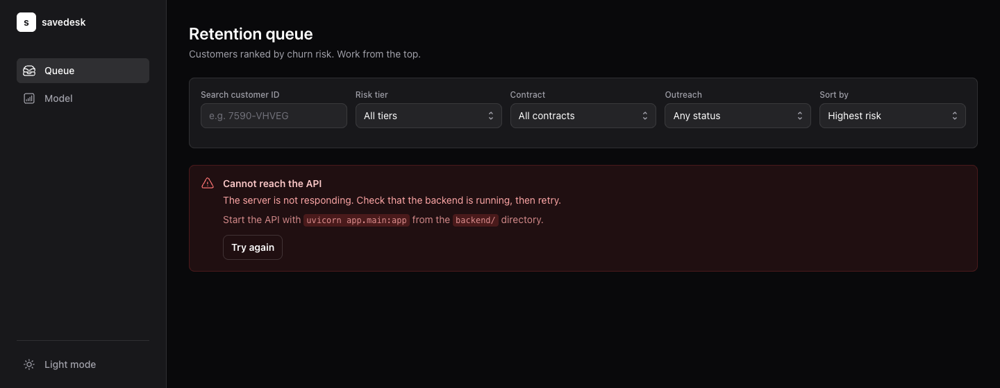
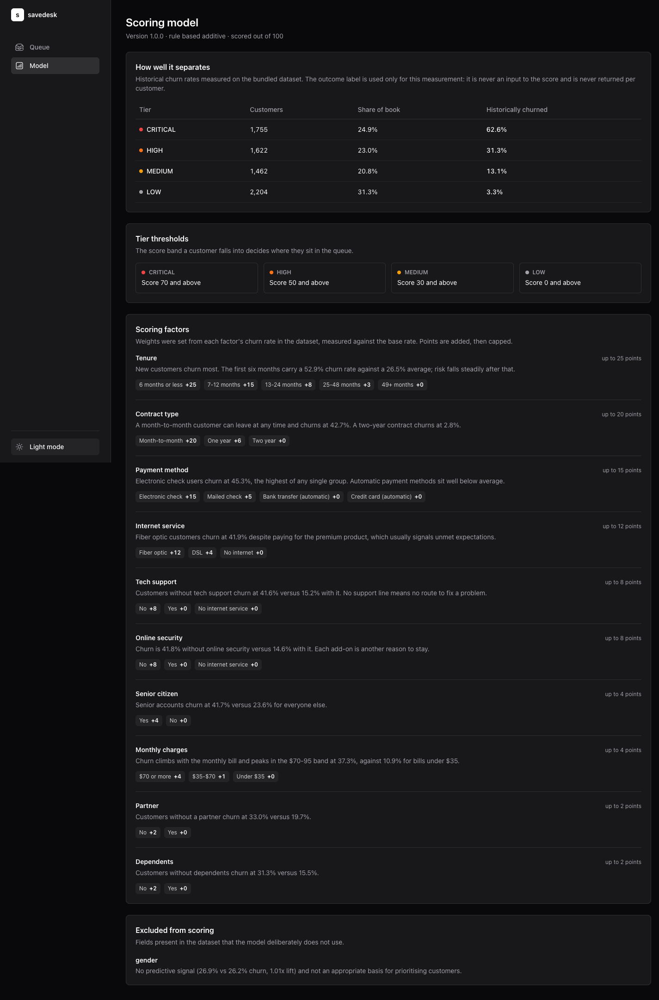
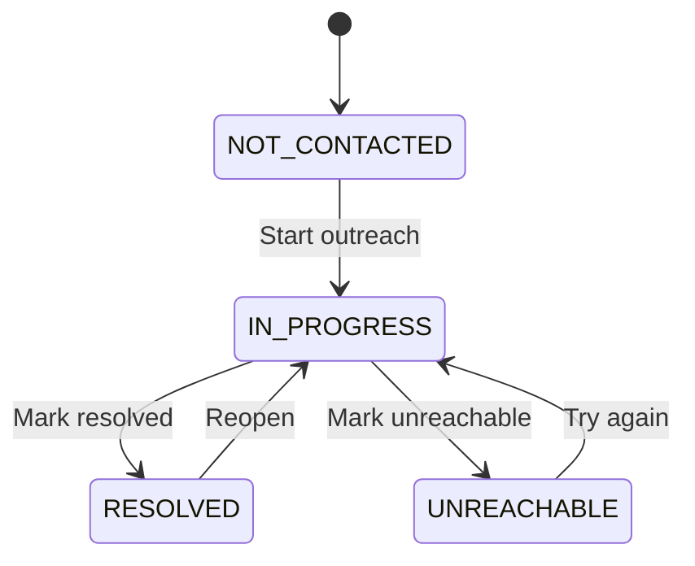

# SaveDesk

A churn risk and retention console built for the full-stack technical
assessment. In telco retention, a customer you manage to keep is called a
"save", which is where the name comes from.

The tool is meant for a retention agent starting their day. It answers three
questions: who is at risk right now, why the model thinks so, and what has
already been done about it.

Backend is Python (FastAPI), frontend is React with TypeScript. The Telco
Customer Churn dataset is committed under `data/` and loaded into memory at
startup, so there is no database and nothing to download.

## Contents

- [Running it](#running-it)
- [API](#api)
- [What the UI does](#what-the-ui-does)
- [Design decisions](#design-decisions): [FastAPI](#why-fastapi),
  [React](#why-react-and-tanstack-query), [data modelling](#data-modelling),
  [risk scoring](#risk-scoring),
  [one ruleset](#one-ruleset-one-source-of-truth),
  [state machine](#outreach-state-machine)
- [Implementation notes](#implementation-notes):
  [pagination](#pagination-and-filtering),
  [errors and logging](#errors-and-logging), [concurrency](#concurrency),
  [a dataset quirk](#a-quirk-in-the-dataset)
- [Testing](#testing)
- [Project layout](#project-layout)
- [Trade-offs and shortcuts](#trade-offs-and-shortcuts)
- [With more time](#with-more-time)

## Running it

You need Python 3.11+ and Node 20+. Two terminals, roughly two minutes.

Backend, from the repo root:

```bash
cd backend
python3 -m venv .venv && source .venv/bin/activate
pip install -r requirements.txt
uvicorn app.main:app --port 8000
```

Frontend, in a second terminal:

```bash
cd frontend
npm install
npm run dev
```

Then open http://localhost:5173. The API's interactive docs are at
http://localhost:8000/docs if you want to try the endpoints directly.

To run the tests:

```bash
cd backend
pip install -r requirements-dev.txt
pytest          # 135 tests, about a second
ruff check . && ruff format --check .
```

There is no `.env` file to fill in. `frontend/.env.example` exists only if you
need to point the UI at an API on a different host.

## API

All routes are under `/api/v1`.

| Method | Path | Purpose |
|---|---|---|
| GET | `/customers` | Paginated, filterable, sortable list with risk scores |
| GET | `/customers/{id}` | Full record, score, and the factor breakdown behind it |
| PATCH | `/customers/{id}/outreach` | Move a customer to a new outreach status |
| GET | `/model/info` | The scoring rules, the workflow, and measured tier accuracy |
| GET | `/health` | Liveness check, reports how many customers loaded |

## What the UI does

The list view is sorted by risk score, highest first, so the first page is
effectively the call list. Four tiles across the top show how many customers
are in each tier and what share of them actually churned in the historical
data. Clicking a tile filters to that tier. You can also filter by contract or
outreach status, search by customer ID, and sort by tenure or monthly spend.



The detail view shows the full customer record, the score, and every factor
that contributed to it, ordered largest first, each with a short explanation.
The bars give a sense of relative weight so the agent can see what to lead the
call with. The outreach panel on the right moves a customer through the
workflow and takes an optional note; it only shows buttons for transitions the
API will actually accept.



If the API is unreachable the agent gets an explanation and a retry button
rather than an empty table or a console error.



The model page renders whatever `/model/info` returns: every factor with its
bands and points, the tier thresholds, and how well the tiers separate against
the dataset's own outcomes. It is read-only.



The screenshots are in dark mode. The console follows the system light/dark
preference, and there is a manual toggle at the bottom of the sidebar.

## Design decisions

### Why FastAPI

I chose FastAPI primarily for its request validation. Every query parameter and
request body is declared as a type, and anything that does not match is
rejected before my handler runs. That covers most of the 400-level error
handling without any hand-written parsing code.

The generated docs at `/docs` were the second reason. A reviewer can exercise
every endpoint in a browser without reading the routing code or writing curl
commands.

Third, the assessment asks about parallelism, and FastAPI's async support
provides a direct answer. There is more on its practical effect at this data
size below.

Flask would have worked, but I would have had to write the validation myself
and separately justify a worker model. Django REST Framework brings an ORM and
migrations, which a service with no database would only have to turn off.

### Why React and TanStack Query

The brief specifically grades what the UI does when the API is slow or down. I
used TanStack Query because loading, error, retry and cache states are part of
its model rather than something added afterwards. It also has
`placeholderData: keepPreviousData`, which keeps the current page visible while
the next one loads, so paging and filtering never flash an empty table.

Styling is Tailwind CSS. The base components come from the Tailwind Plus
Catalyst kit under a Tailwind Plus licence, which is why this repository is
private.

### Data modelling

There are two kinds of data in this application, and they are kept separate
deliberately.

Customer records never change. They are read from the CSV once at startup,
parsed into frozen dataclasses, and scored immediately. The scoring rules are
deterministic and the inputs are fixed, so re-scoring on every request would
just be repeated work for the same answer.

Outreach state is the only mutable thing in the application. It lives in its
own dictionary behind a lock, holding the current status, a timestamp, and an
append-only history of transitions.

Separating them is what keeps the concurrency model simple, and it is also the
point at which a database would later be introduced. `CustomerStore` is the
only class that would have to change.

There are also two shapes for a customer on the wire. The list endpoint returns
six fields per customer; the detail endpoint returns everything. The table does
not need twenty-one columns, and payload size is usually the first thing that
stops a list endpoint scaling.

### Risk scoring

The scoring function is a rule-based heuristic standing in for the data science
team's model. The weights are derived from the data rather than chosen by
judgement: I measured each factor's churn rate in the dataset against the 26.5%
base rate, and used the ratio between them (the lift) to set the points.

| Factor | Highest-risk segment | Churn rate | Lift | Points |
|---|---|---|---|---|
| Tenure | 0-6 months | 52.9% | 1.99x | 25 |
| Contract | Month-to-month | 42.7% | 1.61x | 20 |
| Payment method | Electronic check | 45.3% | 1.71x | 15 |
| Internet service | Fiber optic | 41.9% | 1.58x | 12 |
| Tech support | None | 41.6% | 1.57x | 8 |
| Online security | None | 41.8% | 1.57x | 8 |
| Senior citizen | Yes | 41.7% | 1.57x | 4 |
| Monthly charges | $70-95 | 37.3% | 1.41x | 4 |
| Partner | None | 33.0% | 1.24x | 2 |
| Dependents | None | 31.3% | 1.18x | 2 |

The weights add up to exactly 100. That means a score is always just the sum of
its factors and never needs clamping, so the breakdown on the detail page
always reconciles with the number next to it. There is an assertion in
`scoring.py` and a test so that a future weight change cannot quietly break
this. Tiers are CRITICAL at 70 and above, HIGH at 50, MEDIUM at 30, and LOW
below that.

To hit exactly 100 I trimmed the four smallest weights: senior citizen and
monthly charges from 6 points to 4, partner and dependents from 3 to 2. I chose
those four because they are the least actionable. An agent can sell a customer
tech support or move them onto an annual contract, but cannot change their age
or household. Since the tool exists to help decide what to do about a customer,
the factors an agent can act on should carry more of the weight.

The model is additive because the console is required to explain its output. A
logistic regression would likely score about as well, but its output could not
be decomposed into "the contract accounts for 20 of these 78 points", and the
second backend requirement asks for exactly that breakdown.

Gender is excluded from scoring, for two independent reasons. It has no
meaningful predictive value in this dataset (26.9% versus 26.2%, a lift of
1.01x), and scoring an individual on a protected characteristic is not an
appropriate basis for deciding who gets contacted. The exclusion and its
reasoning are published on `/model/info`, and a test asserts that gender cannot
change a score.

Measured against the dataset's actual churn labels, the tiers separate like
this:

| Tier | Customers | Share of book | Historically churned |
|---|---|---|---|
| CRITICAL | 1,755 | 24.9% | 62.6% |
| HIGH | 1,622 | 23.0% | 31.3% |
| MEDIUM | 1,462 | 20.8% | 13.1% |
| LOW | 2,204 | 31.3% | 3.3% |

The relationship is monotonic, with a 19x spread between the top and bottom
tiers. An agent working only CRITICAL and HIGH would reach 86% of all eventual
churners while contacting 48% of the customer base, which is the measurable
benefit of prioritising by score rather than working the list arbitrarily.

The `Churn` column is used only for that measurement. It is never an input to
the score, and it is never returned for an individual customer, since exposing
the known outcome would defeat the purpose of the score. Tests cover both.

### One ruleset, one source of truth

`RULES` in `backend/app/services/scoring.py` is the only place the weights are
defined. `score_customer()` applies it, `GET /model/info` publishes it, and the
frontend renders both its "why" panel and its model page from that response.
The UI does not hardcode any thresholds, so what the agent is told and what the
API computed cannot drift apart. A test asserts that the published weights
match the ones actually applied.

### Outreach state machine



The transitions live in one dictionary rather than being spread across `if`
statements, which is what lets the API publish the workflow and the UI render
its buttons from it.

`NOT_CONTACTED -> RESOLVED` is rejected with 409 Conflict. Allowing it would
mean recording a churn risk as handled when nobody ever made the call, which
corrupts the dashboard the team uses to know what work is left. Going through
`IN_PROGRESS` costs one extra click.

`UNREACHABLE` exists because an agent who has left three voicemails has not
resolved anything and is not actively working it either. Without that state
they would have to record something untrue in one direction or the other.

No transition returns to `NOT_CONTACTED`. Once contact has been attempted the
record should reflect that permanently, and the history is append-only for the
same reason. Re-submitting the status a customer already holds is also
rejected, since in practice it indicates a duplicate submission.

## Implementation notes

### Pagination and filtering

Both are done server-side. `GET /customers` takes the filters, applies the
sort, and returns a single page along with `items`, `page`, `page_size`,
`total` and `total_pages`. The order is filter, then sort, then slice, so the
sort only ever touches rows that matched.

`page_size` is capped at 100. Without a cap a client could ask for 100,000 rows
and pull the whole dataset into one response; the request is now rejected
before any work happens.

Rows are pre-sorted by risk score at startup, so the default view (the one an
agent opens every morning) needs no sorting at all.

### Errors and logging

Errors use RFC 9457 Problem Details with the `application/problem+json` content
type, so the error format follows an established standard:

```json
{
  "type": "https://savedesk.local/problems/invalid-transition",
  "title": "Invalid outreach transition",
  "status": 409,
  "detail": "Cannot move a customer from NOT_CONTACTED to RESOLVED. Allowed from NOT_CONTACTED: IN_PROGRESS.",
  "instance": "/api/v1/customers/7590-VHVEG/outreach",
  "request_id": "5f2c1e9a…"
}
```

Where there is a sensible next step, the `detail` field says what it is.

| Code | When |
|---|---|
| 400 | Bad input: out-of-range page size, unknown status or tier, malformed body |
| 404 | No such customer |
| 409 | The transition conflicts with the customer's current status |
| 500 | A bug. Traceback is logged server-side; the client only gets the request ID |
| 503 | The dataset is not loaded |

Validation failures return 400 rather than FastAPI's default 422. Both are
defensible, but 400 is more widely understood for bad input and it is what the
brief asks for.

Logs are one JSON object per line with the method, path, status, duration and
request ID. Every request gets an ID, which is returned in the `X-Request-ID`
header and included in error bodies, so a screenshot from a user can be traced
back to a specific log line. Rejected transitions are logged at INFO rather
than ERROR, since they represent the state machine behaving correctly rather
than a service failure.

If the dataset fails to load, the application refuses to start. A service that
starts successfully and then returns 500 on every request is harder to diagnose
than one that halts immediately and reports the cause.

### Concurrency

All handlers are async, so concurrent requests share one event loop.

The benefit is limited at this data size, and it is worth stating why. The
dataset is already in memory, so the only genuine I/O boundary is the network,
which the event loop already handles. Moving an in-memory dictionary lookup
into a thread pool would add overhead without reducing latency, so it is not
done. Parallelism would become relevant if scoring moved behind a remote
service (`httpx` with `asyncio.gather`) or if bulk rescoring made the workload
CPU-bound (`run_in_executor`).

The case where concurrency does matter is outreach updates, where the
read, the validation and the write all happen under a single lock. Validating
outside the lock would let two simultaneous requests both read `NOT_CONTACTED`
and both write. There is a test that races ten threads at one customer and
asserts that exactly one succeeds.

### A quirk in the dataset

Eleven rows have a blank `TotalCharges`, and it is the only column with a blank
anywhere in the file. All eleven have `tenure == 0`, all have a
`MonthlyCharges` value, and all have `Churn == No`.

So this is not missing data. These are customers who signed up but have not
completed a billing cycle yet, which means they genuinely have been charged
nothing so far and zero is the correct value. The loader records `0.0` for that
reason rather than as a blanket null-fill, and logs the count once at INFO.

A blank on a customer with `tenure > 0` would be a different situation, since
that one really would be missing data, so it is counted separately and logged
at WARNING. Both paths are tested.

The CSV is committed rather than downloaded at runtime.
`kagglehub.dataset_download("blastchar/telco-customer-churn")` returns this
exact file, blanks included, so fetching it at startup would clean nothing and
would add a Kaggle account and a network call to the setup.

## Testing

135 tests, all fast, none touching the network.

- `test_scoring.py` covers every factor's points, both sides of every tier
  threshold, the 100-point total, the breakdown summing to the score, and the
  fact that neither gender nor the churn label can affect a result.
- `test_outreach.py` checks all 16 (from, to) pairs against a truth table, plus
  the specific business rules.
- `test_api.py` covers the pagination envelope, each filter, the status codes,
  the problem+json shape, request IDs, and a full outreach lifecycle.
- `test_store.py` covers CSV parsing, the eleven blanks, malformed rows,
  duplicate IDs, concurrent updates, and tier separation.

The transition truth table is written out by hand in the test rather than
generated from `ALLOWED_TRANSITIONS`, because a generated table would pass
regardless of what the implementation did. The API tests run against a
three-customer fixture store injected through FastAPI's `Depends`, which keeps
them deterministic and independent of the CSV; only `test_store.py` reads the
real file.

The frontend has no unit tests. Given the time available, I prioritised backend
coverage and verified the UI manually across the list, filter, detail, status
change and API-down paths. There is also no load testing and no property-based
testing.

## Project layout

```
savedesk/
├── data/                       # bundled CSV
├── backend/
│   ├── app/
│   │   ├── main.py             # app, middleware, exception handlers
│   │   ├── config.py           # env-var settings
│   │   ├── errors.py           # error types -> problem+json
│   │   ├── logging_config.py   # JSON logs, request IDs
│   │   ├── routes/             # HTTP only
│   │   ├── models/             # domain.py (internal) / api.py (wire)
│   │   ├── services/           # scoring, outreach, query
│   │   └── data_access/        # CSV loading, in-memory store
│   └── tests/
└── frontend/src/
    ├── api/                    # client.ts (HTTP) + queries.ts (hooks)
    ├── components/             # presentational
    │   └── ui/                 # Catalyst components (third-party)
    ├── hooks/                  # debounce, theme
    ├── pages/                  # queue, detail, model
    └── types/                  # shared response types
```

The rule I used to keep the separation honest is that nothing in `services/`
imports FastAPI. Scoring and the transition rules are plain functions over
plain data, which is why they are easy to test. Routes translate HTTP and do
nothing else.

## Trade-offs and shortcuts

State is held in memory and resets when the server restarts, which the brief
allows. `CustomerStore` is the only thing a database would replace.

Filtering is a linear scan over 7,043 rows, which takes a fraction of a
millisecond. At a million rows it would need indexes.

`/model/info` is read-only. Editable weights would need versioning and an audit
trail covering who changed what and which version scored a given customer,
which is more than this exercise calls for.

Search matches on customer ID only, because the dataset has no names in it.

There is no authentication, per the brief, though it is the first thing a
production version would need. Transition history is only really useful with an
agent's name attached to it.

## With more time

The main scaling bottleneck is that this is a single process holding all its
state in memory. This is adequate for a single instance but does not extend to
two, since a second replica would hold its own copy of the outreach state and
the two would immediately diverge. Most of the items below follow from that.

1. Move outreach state into Postgres. It is the change that unblocks running
   more than one instance, and `CustomerStore` is already the seam it would
   slot into.
2. Replace the heuristic with the real model behind an HTTP call, keeping
   `/model/info` as the contract. Version every score so a decision can be
   traced back to the ruleset that produced it.
3. Switch to cursor-based pagination. Offset paging re-scans from the start on
   every page, so past a few hundred thousand rows a keyset cursor on
   `(risk_score, id)` would keep deep pages from getting slower.
4. Cache scored pages in Redis, keyed by filter set. Scores only change when
   the model version changes, so invalidation stays simple.
5. Add authentication and attach the agent's identity to every transition.
   Right now the history records what happened but not who did it.
6. Add frontend tests, starting with the outreach panel and the error paths,
   since those are the parts with real logic in them.
7. Add bulk actions so an agent can move a filtered set of customers at once
   rather than working through them one at a time.
